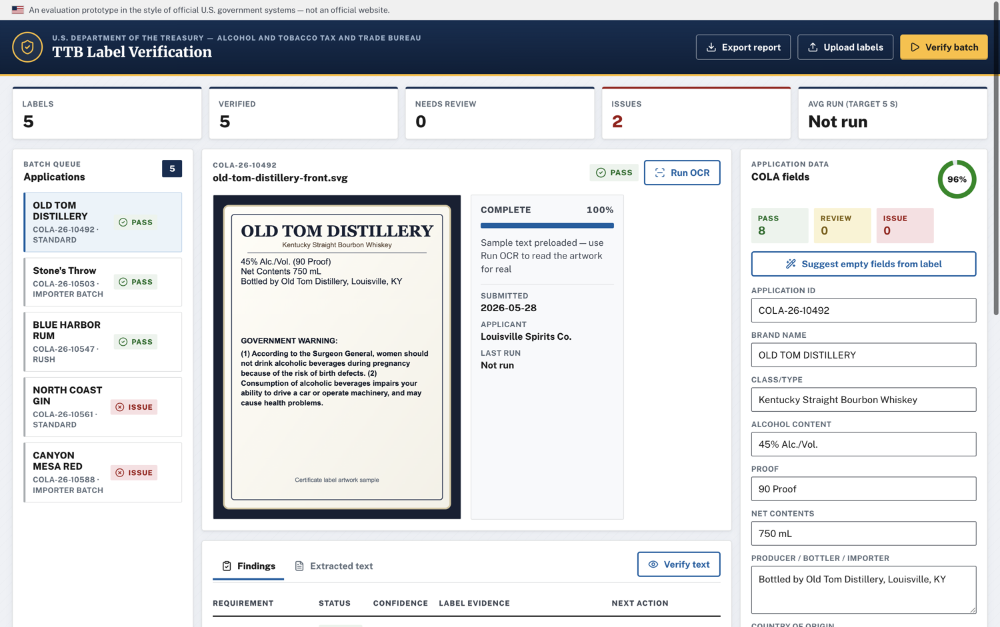
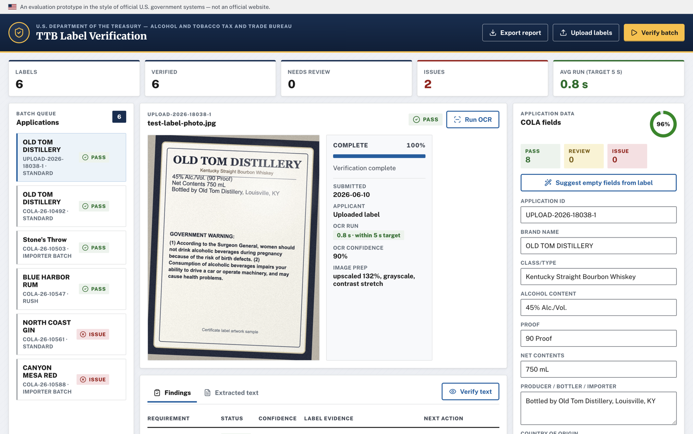
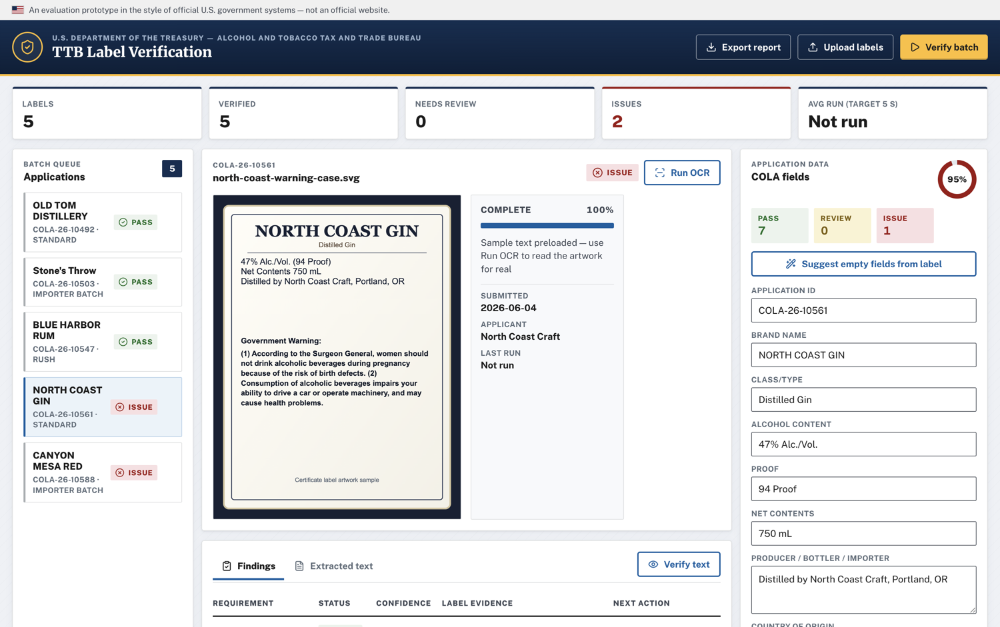

# TTB Label Verification Prototype

Prototype for the Alcohol and Tobacco Tax and Trade Bureau (TTB) compliance queue: it OCRs alcohol beverage label images in the browser and deterministically verifies them against COLA application data — brand, class/type, alcohol content, net contents, producer address, import statements, and the mandatory government health warning — returning evidence-backed pass/review/issue findings in under a second per label once the engine is warm.



## Quick start

Requires Node.js ≥ 20.19.

```bash
npm install        # also vendors OCR assets into public/tesseract
npm run dev        # http://127.0.0.1:5173
```

```bash
npm test           # 111 unit, component, and adversarial tests
npm run lint       # ESLint
npm run typecheck  # tsc
npm run build      # production bundle in dist/ (self-contained, ~16 MB)
npm run preview    # serve the production build locally
```

Live prototype: https://treasury-label-verifier.pages.dev (deploy `dist/` to any static host — Cloudflare Pages, Netlify, Azure Static Web Apps).

## Architecture

Everything runs client-side. There is no backend, no database, and — by deliberate design — **no outbound network traffic**: the assignment notes that federal firewalls may block cloud AI APIs, so the OCR engine (Tesseract.js), its WASM cores, and the English language model are vendored at install time and served same-origin from `/tesseract`.

```
┌─ React UI (components/) ──────────────────────────────────────┐
│  TopBar · MetricsBar · QueuePanel · LabelPreview              │
│  ResultsPanel/FindingsTable · ApplicationPanel · Toasts       │
└──────────────┬────────────────────────────────────────────────┘
               │ useLabelQueue (hooks/) — reducer state, batch
               │ lanes with concurrency 2, cancel, suggestions
       ┌───────┴────────┐
┌──────▼──────┐  ┌──────▼───────────────────────────────────────┐
│ OCR engine  │  │ Verification rules (lib/)                    │
│ (lib/ocr/)  │  │  text.ts      normalization + fuzzy matching │
│ worker pool │  │  extract.ts   ABV/proof/volume extraction    │
│ preprocess  │  │  warning.ts   statutory warning word diff    │
│ local WASM  │  │  verification.ts  the 8 findings             │
└─────────────┘  └──────────────────────────────────────────────┘
```

The verification rules are pure TypeScript — transparent, unit-tested, and auditable, which matters more in a compliance setting than a black-box model. The OCR layer is the only probabilistic step, and its uncertainty is surfaced (per-run confidence, fuzzy-match annotations) rather than hidden.

## Requirements traceability

| Assignment requirement | Implementation | Verified by |
| --- | --- | --- |
| Brand name | `checkPhrase` with OCR-tolerant token matching — `src/lib/verification.ts`, `src/lib/text.ts` | `verification.test.ts`, `text.test.ts` |
| Class/type designation | `checkPhrase` (looser thresholds for long designations) | `verification.test.ts` |
| Alcohol content % | `checkAlcohol`: ABV + proof extraction, tolerance ±0.3 pp, ABV↔proof consistency cross-check | `extract.test.ts`, `verification.test.ts` |
| Net contents | `checkNetContents`: mL / L / fl oz parsed and converted before comparison | `extract.test.ts`, `verification.test.ts` |
| Producer name and address | `checkPhrase` with address-friendly thresholds | `verification.test.ts` |
| Country of origin (imports) | `checkCountryOfOrigin`: required for imports, waived for domestic; importer address checked separately | `verification.test.ts` |
| Government warning, exact match, "GOVERNMENT WARNING:" capitalization | `compareGovernmentWarning`: word-level diff against the 27 CFR Part 16 text — missing words, OCR-misread pairs, *and inserted words* all reported; all-caps prefix checked on raw text; bold surfaced as an explicit manual-check item (OCR cannot prove boldness) | `warning.test.ts`, `verification.test.ts` |
| < 5 s per label | Persistent Tesseract worker pool (cold start paid once), image preprocessing, batch concurrency 2. Typical: well under 1 s warm per label, ~2–3 s for the first label including engine load (2024 laptop). Every run's OCR-inclusive time is shown in the UI against the 5 s target, so evaluators see their own numbers | Live run-time chip + `Avg run` metric |
| Batch upload | Multi-file picker, drag-and-drop anywhere, clipboard paste; `Verify batch` processes the queue on 2 lanes with progress and stop | `App.test.tsx`, manual |
| Imperfect photos (angle, lighting, glare) | Canvas preprocessing (upscale/downscale, grayscale, percentile contrast stretch) handles lighting, glare, and mild rotation; Levenshtein token matching (numbers always exact) absorbs character-level misreads. Full deskew/perspective correction is listed as a next step | `preprocess.test.ts`, `text.test.ts`; see demo below |
| No blockable outbound APIs | All OCR assets vendored by `scripts/vendor-ocr-assets.mjs` and served same-origin; enforced by a same-origin Content-Security-Policy in `index.html`, verified by browser network audit (only host contacted: the app origin), and backed by a CI assertion that all five OCR assets land in `dist/tesseract/` | CI step, manual network audit |
| Intuitive for non-technical staff | Single-screen workbench, plain-language findings with evidence and next actions, color+icon status badges, keyboard-navigable tabs, ARIA live progress, toasts for every outcome | `App.test.tsx` (a11y roles), manual |

## Handling imperfect photos — demo

`docs/assets/test-label-photo.jpg` is a deliberately bad capture: rotated 2.4°, sensor noise, dim warm lighting, and a glare blob. Drag it into the app and run OCR:



The pipeline upscales and contrast-stretches it, reads it at ~90% OCR confidence in under a second, and the government warning still verifies word-for-word. The glare destroys the brand headline — and that's the point of the design: **Suggest empty fields from label** prefills what it can across all seven required elements (brand, class/type, ABV, proof, net contents, producer/importer statement, country of origin), the agent types what OCR couldn't see, and verification gives evidence for every conclusion.

When OCR misreads a character, findings say so explicitly rather than failing silently, e.g. `Possible OCR misreads: MACHINERV → MACHINERY` with a recommendation to zoom the image — and the capitalization rule stays strict:



## Verification statuses

- **Pass** — requirement matched; no action needed.
- **Review** — partial/ambiguous match (e.g. OCR-level misreads, unit mismatch); agent judgment required.
- **Issue** — substantive mismatch (wrong ABV, non-compliant warning prefix, missing statement); request corrected artwork or data.
- **Needs data** — the application field is empty; the check did not run (and is excluded from the match score).

The overall score is the mean confidence of the checks that actually ran. A status of Issue always outranks Review, which outranks Needs data.

## Key design decisions

- **USWDS-derived design language.** The assignment prescribes no visual style, but federal digital services are required to follow the U.S. Web Design System (21st Century IDEA Act), and TTB.gov is built on it. The UI adopts USWDS conventions — Public Sans and Merriweather (the federal typefaces, self-hosted so no font CDN is contacted), the federal blue/gold palette, the official-banner and identifier patterns, USWDS table rules, tags, and the standard focus ring — so the tool reads as native to the TTB ecosystem. The banner explicitly states it is an evaluation prototype, not an official site.
- **Deterministic rules over a cloud model.** Outbound AI APIs are explicitly at risk of being firewalled, and compliance decisions need audit trails. Rules are testable; their failure modes are inspectable.
- **Rules are hardened against adversarial inputs, not just happy paths.** Statements match within a single label statement (one to three adjacent lines) using order-aware scoring with a compactness penalty, so a producer address cannot be assembled from tokens scattered across the label — in any order; the warning diff rejects *inserted* words, not just missing ones; import origin requires an actual origin statement ("Product of …"), not the country name appearing anywhere; and percentages only count as ABV when alcohol wording appears next to them, with conflicting duplicate statements flagged for review. Each of these has a dedicated regression test in `src/lib/adversarial.test.ts`.
- **Findings can never go stale.** Editing any application field or the extracted text re-runs verification immediately — the queue badge, score, and CSV export always reflect the data on screen.
- **OCR workers are pooled and reused.** `tesseract.recognize()` one-shot would re-download nothing (assets are local) but still re-initialize WASM and the language model per call — several seconds each time. The pool pays that once and runs each subsequent label in well under a second; batch lanes match the pool size.
- **Numbers never fuzzy-match.** `45` vs `46` is a substantive difference on a label; only alphabetic tokens get Levenshtein tolerance, scaled by word length.
- **The warning check is a real diff, not a similarity score.** The statute fixes the wording, so the finding lists exactly which words are missing or misread, and the all-caps prefix is checked against the raw (un-normalized) text. Boldness physically cannot be proven from OCR, so a passing finding still tells the agent to confirm it visually.
- **Suggestions are seeded, never trusted.** Field suggestions only fill *empty* fields and always prompt review — the application of record remains the agent's responsibility.
- **Privacy by default.** Images and form data stay in browser memory for the session; nothing is uploaded, stored, or logged anywhere.

## Tools used

- **React 19 + TypeScript + Vite** — UI and build; the app compiles to static files with no server.
- **Tesseract.js 7** (WASM, LSTM engine) — in-browser OCR; all engine assets self-hosted.
- **Vitest + Testing Library (jsdom)** — unit and component tests.
- **ESLint (typescript-eslint, react-hooks)** — static analysis; **GitHub Actions** — CI.
- **Public Sans & Merriweather** via Fontsource — the USWDS federal typefaces, self-hosted.
- **Cloudflare Pages** — static hosting for the deployed prototype.

## Code organization

```
scripts/vendor-ocr-assets.mjs   copies worker/WASM/language model from node_modules
src/
  components/                   presentational components (one per panel)
  hooks/useLabelQueue.ts        queue state machine + OCR/verify pipelines
  lib/
    text.ts                     normalization, Levenshtein, fuzzy coverage
    extract.ts                  ABV/proof/volume extraction, field suggestions
    warning.ts                  statutory warning word-level diff
    verification.ts             the eight findings + summary
    export.ts                   CSV batch report
    ocr/engine.ts               pooled Tesseract workers, local asset paths
    ocr/preprocess.ts           canvas grayscale/contrast/scale (pure core)
  data/sampleLabels.ts          five seeded cases incl. known failure modes
```

Sample batch covers the spectrum on load: clean pass, punctuation/case differences, an import with origin + importer address, a title-case warning prefix (Issue), and an ABV mismatch (Issue).

## Testing

`npm test` runs 111 tests: normalization and fuzzy-matching behavior (including the no-fuzzy-numbers rule), unit conversions, ABV/proof consistency, warning diff cases (exact pass, title-case fail, missing words, misread words), extraction suggestions, CSV escaping, preprocessing math, jsdom component tests for the queue, tab keyboard navigation, live re-verification on field edits, and record removal; and an adversarial suite (`adversarial.test.ts`) that pins the corrected behavior for constructed attack inputs — inserted warning words, cross-line address assembly, origin-statement-free imports, context-free percentages, and CSV formula injection. CI (GitHub Actions) runs lint, typecheck, tests, build, and asserts the OCR assets land in `dist/`.

## Assumptions and limitations

- This is a standalone prototype: no COLA integration, identity, retention, or case management.
- ABV tolerance is a flat ±0.3 pp. Real TTB tolerances vary by commodity (27 CFR 4.36, 5.65, 7.71); encoding them per-commodity is a straightforward next step.
- Country-of-origin and importer-address checks apply a simplified rule: required for imports, waived for domestic products.
- The warning prefix's **boldness** requires human confirmation; OCR proves wording and capitalization only.
- PDF artwork is out of scope; convert to images first. OCR is English-only (`eng.traineddata`).
- Severe blur, extreme angles, or very small print can still defeat OCR — the workflow degrades to pasting/typing the label text, which the verifier treats identically.

## Next steps

- Commodity-aware ABV tolerances and standards-of-fill validation for net contents.
- Deskew/perspective correction in preprocessing (the current pass handles lighting and scale).
- Font-size and boldness heuristics from Tesseract's word-level bounding boxes, to assist the manual bold check.
- Reviewer actions (approve / request correction) with an exportable audit trail per finding.

## References

- Take-home instructions: https://github.com/treasurytakehome-rgb/instructions
- TTB health warning guidance: https://www.ttb.gov/regulated-commodities/beverage-alcohol/distilled-spirits/ds-labeling-home/ds-health-warning
